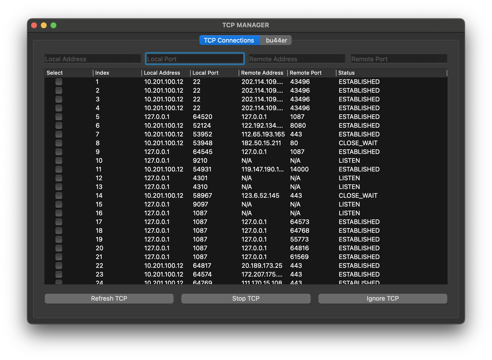

# TCP-Manager
A simple TCP connection manager.    一个简单的TCP连接管理器。



## Features
- view all your TCP connections by ip/port filters
- stop a TCP connection
- ignore a TCP connection

## Installation

```bash
pip install -r requirements.txt
```

## Usage

```bash
python3 tcpm.py
```

- macOS and Linux should use `sudo`

